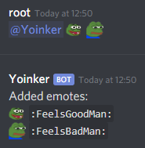

# discord-yoinker

Just a small Discord bot to "borrow" emotes from other servers, mention the bot with emotes you want and it'll get the job done.

### Notes

* Don't forget to set the bot token at the end of index.js! You can get a bot token by following [this guide](https://discordjs.guide/preparations/setting-up-a-bot-application.html#creating-your-bot).

* Both mentioner and the bot needs "Manage Emojis" permission. The bot also needs "Send Messages" permission for the channel it was mentioned in.